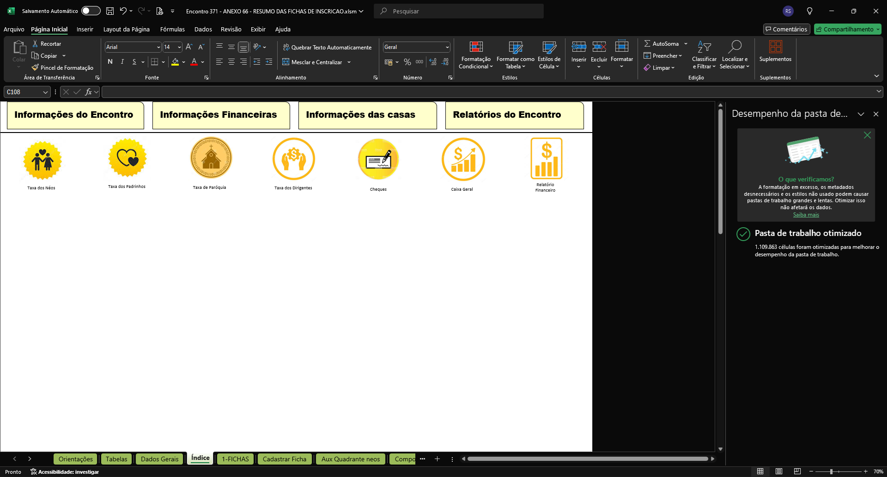

# Ajustes na planilha Encontro 371 - ANEXO 66 - RESUMO DAS FICHAS DE INSCRICAO.xlsm

```code
Por: Romildo
data: 20/09/2024 
```

## Ajustes efetuados

1. Efetuada otimização recomendada pelo Excel conforme 


2. Aba "Tabelas" - correção de Linhais para Pinhais em "São José do Pinhais"

3. Aba "Composição Equipe 2" 
    - de "Col. Farias" para "Col. Faria"
    - de "Santa Teresinha de Lisieux / Guaraituba" para "Santa Teresinha de Lisieux"

4. Aba "An 48 - Relação Quartos NEOS"
    - célula B9 de "='Planta Quartos - Mossugue'!A15" para "=CONCATENAR("ENCONTRO Nº ";'Dados Gerais'!A2)"
    - célula B11 de "='Planta Quartos - Mossugue'!B17" para "=CONCATENAR("REALIZADO NOS DIAS ";'Dados Gerais'!C2)"

5. Aba "Relação de Padrinhos" 
    - célula A10 - de "=@'An 101 - RELATÓRIO FINANCEIRO'!A9:D9" para "=CONCATENAR("REALIZADO NOS DIAS ";'Dados Gerais'!C2)"

6. Aba "An 46 - Relação de Chamada" 
    - célula B9 - de "='Relação de Padrinhos'!A10" para "=CONCATENAR("REALIZADO NOS DIAS ";'Dados Gerais'!C2)"
    - célular B7 - de "='Refrigerantes - NEOS'!C6" para "=CONCATENAR("ENCONTRO Nº ";'Dados Gerais'!A2)"

7. Aba "An 90 - Mesa redonda"
    - célula A8 - de "=@'An 85 - Layout Sala Palestra'!$A$8:$H$8" para "=CONCATENAR("ENCONTRO Nº ";'Dados Gerais'!A2)"
    - célula A10 - de "=@'An 85 - Layout Sala Palestra'!$A$10:$H$10" para "=CONCATENAR("REALIZADO NOS DIAS ";'Dados Gerais'!C2)"

8. Aba "ANEXO 98 - RELAÇÃO PREMIAÇÃO"
    - célula A8 - de "=@'An 85 - Layout Sala Palestra'!$A$8:$H$8" para "=CONCATENAR("ENCONTRO Nº ";'Dados Gerais'!A2)"
    - célula A10 - de "=@'An 85 - Layout Sala Palestra'!$A$10:$H$10" para "=CONCATENAR("REALIZADO NOS DIAS ";'Dados Gerais'!C2)"

9. Aba "Mini-Mercado"
    - célula C7 - de "='An 85 - Layout Sala Palestra'!A8" para "=CONCATENAR("ENCONTRO Nº ";'Dados Gerais'!A2)"
    - célula C9 - de "='An 85 - Layout Sala Palestra'!A10" para "=CONCATENAR("REALIZADO NOS DIAS ";'Dados Gerais'!C2)"

10. Aba "An 121 - Observações"
    - célula C7 - de "='An 85 - Layout Sala Palestra'!A8" para "=CONCATENAR("ENCONTRO Nº ";'Dados Gerais'!A2)"
    - célula C9 - de "='An 85 - Layout Sala Palestra'!A10" para "=CONCATENAR("REALIZADO NOS DIAS ";'Dados Gerais'!C2)"

11. Aba "Refrigerantes - NEOS"
    - célula C6 - de "='An 121 - Observações'!B7" para "=CONCATENAR("ENCONTRO Nº ";'Dados Gerais'!A2)"
    - célula C8 - de "='Mini-Mercado'!C9" para "=CONCATENAR("REALIZADO NOS DIAS ";'Dados Gerais'!C2)"

12. Aba "An 83 - Relação de Palestras"
    - célula B9 - de "='An 46 - Relação de Chamada'!B7" para "=CONCATENAR("ENCONTRO Nº ";'Dados Gerais'!A2)"
    - célula B11 - de "='Refri - Equipe C e Secretaria'!$B$8" para "=CONCATENAR("REALIZADO NOS DIAS ";'Dados Gerais'!C2)"

13. Aba "An 78 - ApreS Equipe C - Secret"
    - célula B9 - de "='Planta Quartos - Mossugue'!A15" para "=CONCATENAR("ENCONTRO Nº ";'Dados Gerais'!A2)"
    - célula B11 - de "='Refri - Equipe C e Secretaria'!$B$8" para "=CONCATENAR("REALIZADO NOS DIAS ";'Dados Gerais'!C2)"

14. Aba "An 92 - Resumo orações"
    - célula A8 - de "=@'An 101 - RELATÓRIO FINANCEIRO'!A7:D7" para "=CONCATENAR("ENCONTRO Nº ";'Dados Gerais'!A2)"
    - célula A10 - de "=@'An 101 - RELATÓRIO FINANCEIRO'!A9:D9" para "=CONCATENAR("REALIZADO NOS DIAS ";'Dados Gerais'!C2)"

15. Aba "Refri - Equipe C e Secretaria"
    - célula B6 - de "='An 92 - Resumo orações'!A8" para "=CONCATENAR("ENCONTRO Nº ";'Dados Gerais'!A2)"
    - célula B8 - de "=@'Planta Quartos - Mossugue'!B17:U17" para "=CONCATENAR("REALIZADO NOS DIAS ";'Dados Gerais'!C2)"

16. Aba "An 91 - Quadro Vigilantes"
    - célula B6 - de "=@'Refri - Equipe C e Secretaria'!B6:G6" para "=CONCATENAR("ENCONTRO Nº ";'Dados Gerais'!A2)"
    - célula B8 - de "=@'Planta Quartos - Mossugue'!B17:U17" para "=CONCATENAR("REALIZADO NOS DIAS ";'Dados Gerais'!C2)"


