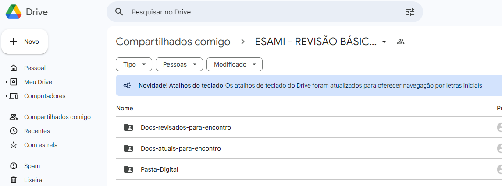

# Plano de Trabalho

***Plano de trabalho***

- Criar grupo WhatsApp para facilitar a comunicação
- Criar pasta no google drive para centralizar os documentos
- Definir pontos de avaliação
- Definir data para reunião presencial

## Detalhes das atividades

1. Criar grupo WhatsApp - ***feito***
2. Criar pasta no google drive - ***feito***
3. Criar pastas de trabalho - ***feito***
    - ***Pasta-Digital*** -> documento digital da pasta física
    - ***Docs-atuais-para-encontro*** -> aqui ficarão os documentos atuais normalmente fornecidos para a coordenação de secretaria de encontro
    - ***Docs-revisados-para-encontro*** -> aqui ficarão os documentos revisados por nós que serão preparados para a próxima coordenação da secretaria de encontro
4. Preparar documentos atuais para o Encontro nº 371 (Heverson)
    - Copiar para a pasta ***Docs-atuais-para-encontro***
5. ***Pasta digital***
    - Mover documento word pasta digital para Pasta-Digital - ***feito***
    - Atualizar documento de acordo com a situação atual (Equipe)
        - Criar cópia com nome rev-2024
    - Preparar para avaliação ESAMI
6. ***Planilha central do Encontro***
    - Fazer cópia para a pasta Docs-revisados-para-encontro
    - Atualizar a planilha de acordo com a situação atual (Claudinei)
    - Preparar para avaliação ESAMI
7. ***Pasta física***
    - Guardar os documentos que compoem a pasta física atual
    - Imprimir a nova versão da ***Pasta digital***
    - Montar a nova ***Pasta física***
    - Preparar para avaliação ESAMI
8. Agendar reunião para avaliação (presencial)

## Formato de trabalho

1. Manter os documentos originais na pasta ***Docs-atuais-para-encontro***
2. Documentos revisados em ***Docs-revisados-para-encontro***
3. Conforme tivermos atualizações reportar no WhatsApp

## Pasta de trabalho - Google Drive

